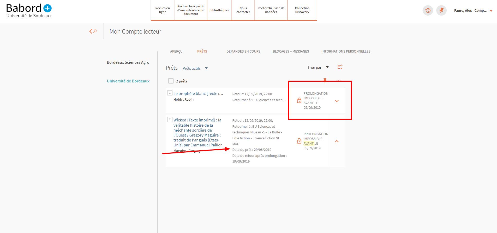
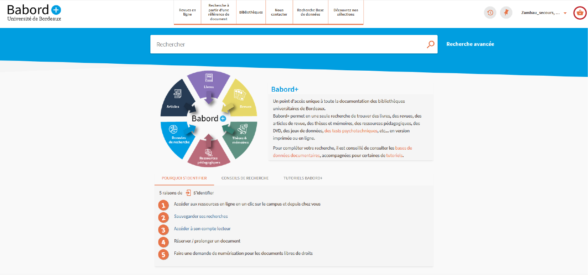

# Liste des modules développées

## prmAuthenticationAfter/forceAuth : force l'authentification à partir d'un lien externe  
Permet d'ajouter un paramètre à une url pointant vers Primo pour rediriger l'utilisateur vers une session authentifiée. Répond à un problème de redirection des usagers depuis les pages ENT des établissements.

**Paramètre à ajouter à l'URL** : ```forcelogin=true```

[:link: prmAuthenticationAfter/forceAuth.js](prmAuthenticationAfter/forceAuth.js)

## prmBackToLibrarySearchButtonAfter/alertMessage : message d'alerte customisable sous la barre de recherche 
**Actuellement Non utilisé par le réseau**

[:link: prmBackToLibrarySearchButtonAfter/alertMessage.js](prmBackToLibrarySearchButtonAfter/alertMessage.js)

## prmBriefResultAfter/customBriefDisplay : Personnalisation de l'affichage des notices dans la liste des résultats

 - Brief Display pour les ressources CDI (Lié à'usage de champs locaux pour les ressources locales)
 - Doublement des champs locaux pour les notices fusionnées

[:link: prmBriefResultAfter/README.md](prmBriefResultAfter/README.md)

## prmCollectionNavigationBreadcrumbsAfter/changeLinkToCollectionDiscovery : personnalisation des liens vers la collection dans l'affichage détaillé

**Problématique consortiale.**

Dans l'affichage détaillé d'une notice lorsque, Primo présente le lien vers une collection qui n'appartient pas à l'institution de la vue en cours de consultation, il ne redirige pas vers la vue de l'institution propriétaire de la collection.
Ce module : 
  - Modifie le lien de redirection pour afficher la sélection dans la vue de l'institution propriétaire
  - Ajoute le nom de l'institution propriétaire de la sélection au titre du lien de premier niveau. Pour modifier le titre du lien modifier la traduction de ui.colldiscovery.lobby.linktitle. + 'code l'institution'.


[:link: prmCollectionNavigationBreadcrumbsAfter/README.md](prmCollectionNavigationBreadcrumbsAfter/README.md)

## prmExploreFooterAfter/logosInst : personnalisation du pied de page
Ajoute un pied de page avec les logos des autres institutions membres du réseau et le lien vers leurs catalogues

[prmExploreFooterAfter/README.md](prmExploreFooterAfter/README.md)

## prmFacetExactAfter/customTLevelFacette : Personnalisation de la top level facette
Supprime les entrées 'peer_reviewed','open_access'et'available'  

[:link: prmFacetExactAfter/README.md](prmFacetExactAfter/README.md)

## prmFullViewServiceContainerAfter/dispoElecAutresInst : modifications sur l'affichage détaillé de la notice
  - Affichage de la disponibilité des documents électroniques dans les autres institutions du réseau **Problématique consortiale.** 
  - Empêche l'affichage des deux champs lds01 det lds02 ans le cas d'une notice fusionnée
  - Mise en forme des résultats CDI
  - Empêche l'affichage d'une section "En rayon" alors qu'il n'y a pas de version imprimée du document.


[:link: prmFullViewServiceContainerAfter/README.md](prmFullViewServiceContainerAfter/README.md)

## prmGalleryItemAfter/customGalleryDisplay : personnalisation de l'affichage des documents dans le collection discovery.
  
Par défaut seuls les titres sont affichés sous les vignettes dans le collection discovery. Ajoute une ligne avec les auteurs et contributeurs (200$f) et l'éditeur et la date d'édition (cf. [lds01 et lds02](https://rebub.u-bordeaux.fr/index.php/babord/procedures/signalement/affichage-des-notices-dans-la-liste-des-resultats/)).

[:link: prmGalleryItemAfter/README.md](prmGalleryItemAfter/README.md)

## prmLoanAfter/itemInLOan : Personnalisation de la liste des documents empruntés dans le compte lecteur

### Empêche la réservation si l'emprunt date d'il y a moins de 7 jours (durée maximale de prolongation dans le réseau)
Si le document est prolongeable et que le prêt est un prêt de plus de 7 jours (variable à adapter selon les besoins), le script regarde si le prêt à eu lieu il y a plus de 7 jours. Si ce n'est pas le cas, il indique quand le document pourra être prolongé.



### Supprime des informations inutiles dans la liste des exemplaires empruntés
Ne sont conservées que la date d'emprunt et la date de retour à l'issue de la prolongation.
Sur la première ligne, supprime la cote et la localisation du document (06/2024)

[:link: prmLoanAfter/README.md](prmLoanAfter/README.md)

## authentificationAutresInst : Personnalisation de l'écran d'authentification.
**Problématiques consortiales**. 
 - Depuis les vues des institutions, invite les utilisateurs à s'athentifier via la vue de leur établissement
 - Depuis la vue réseau, oblige es utilisateurs à s'athentifier via la vue de leur établissement
 - Authentification depuis un domaine personnalisé tout en permettant l'authentification via l'ancien nom de domaine

[:link: prmLoginAfter/README.md](prmLoginAfter/README.md) 


## prmSearchResultAvailabilityLineAfter/affDispo : affichage de la disponibilité pour les notices fusionnées
Correction de différents bug liés à l'affichage de la disponibilité dans B+


[:link: prmSearchResultAvailabilityLineAfter/README.md](prmSearchResultAvailabilityLineAfter/README.md)

## prmServiceDetailsAfter/customFullDisplayRecord : Personnalisation de l'affichage détailllé
- En cas de fusion des notices supprime le lien vers la notice du document sur un autre support 452

[:link: prmServiceDetailsAfter/README.md](prmServiceDetailsAfter//README.md)


## Mise en oeuvre du clique et collecte bordelais pendant le COVID : lien vers la prise de rdv

### panier
Contexte du clique et collecte bordelais.
Ajoute un bouton panier dans le menu de l'utilisateur lorsque celui-ci est authentifié. Ce bouton permet de rediriger l'usager vers la page de prise de rdv de l'application de gestion du clique et collecte.

 

### panierCompteLecteur (Plus utilisé)
Ajoute un  lien vers l'application de prise de rdv dans l'onglet réservation du compte lecteur

[:movie_camera: Lien vers démo loom](https://www.loom.com/share/9a466ce8887846d4aa1b606c1d2cccc9)

[:link: prmUserAreaExpandableAfter/README.md](prmUserAreaExpandableAfter/README.md)


