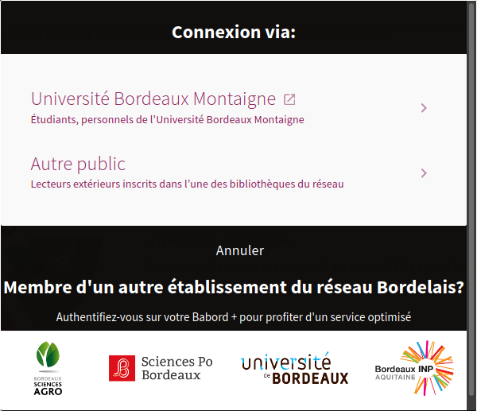

# authentificationAutresInst
**Problématique consortiale**. 
### Personnalisation de l'authentification dans les institutions
Permet de générer des liens d'authentification permettant de rediriger l'utilisateur vers la vue de son institution.
Modifier le message :
 - Message principal : ```parallel.login.autresinst.titre```
 - Message secondaire : ```parallel.login.autresinst.descr```



### Personnalisation de l'authentification depuis la zone réseau
#### Problème :
> Suite à une question d'une lectrice extérieure, il faudrait améliorer l'interface pour qu'il soit indiqué de manière explicite que la connexion est impossible à son compte lecteur depuis cette vue pour les lecteurs extérieurs. 

#### Solution :
Pour la vue réseau uniquement, j'ai masqué en css le formulaire d'authentification et ajouté un message pour inviter les usagers à se rediriger vers les vues des institutions pour s'authentifier.

##### Modifications dans /css/custom1. ccs du customisation package pour la vue 33PUDB_NETWORK
```/* Vue réseau Masquage du formualire d'authentification pour redirger les lecteurs vers les vues des institutions */
prm-login form.layout-full-width {
  display: none;
}
prm-login.layout-row > prm-login-after:nth-child(2) {
  margin: 5px;
  }
prm-login.layout-row prm-login-after h2 {
  text-align: center;
  }
```
##### Libellé
```parallel.login.networkview.titre```

## Proposer différents profil d'authentificatiion SAML en fonction du domaine utilisé pour consulter Babord +
### Besoin
Pouvoir utiliser les ancienne url pointant vers B+ en permettant l'authentification.
### Solution
Nous avons activé dans le BO 2 profils d'authentification SAML pour chaque institution, l'un pour babordplus.hosted.exlibrisgroup.com l'autre pour babordplus.hosted.exlibrisgroup.com. Le controleur va supprimer de la vue l'un des deux profil en fonction du domaine utiliser pour l'affichage de la vue.


